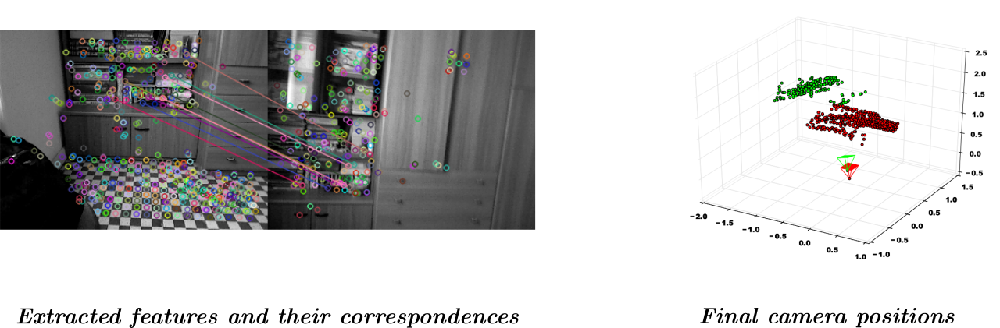

## 3D pose estimation of an RGBD camera using least squares technique

### Introduction
Optimization techniques are being used in many different fields and
applications, also it is known that the machine learning applications are heavily based on the
optimization theorems. One of the popular and fundamental algorithms in this field is Least squares
technique. Least squares are the basis of the SLAM technology which is being used by the mobile
robots of any kind. This project fosuces on the implementation and the usage of the least squares 
technique for estimation of an RGBD camera, in particular the images which have been taken from the Kinect.

### Demonstration

The following figure shows the result of two sample images. Extracted feature points and their correspondences are depicted on the left, and the final relative position and orientation of the camera is illustrated on the right.

### Code
To run the code, please make sure you have the the following requirements installed:

> Requirements:
> - Python > 3.6  
> - OpenCV 3  
> - NumPy  
> - MatplotLib 
> - SciPy 

To run the code, set your parameters in `config.py` file, then run `python slam.py`

